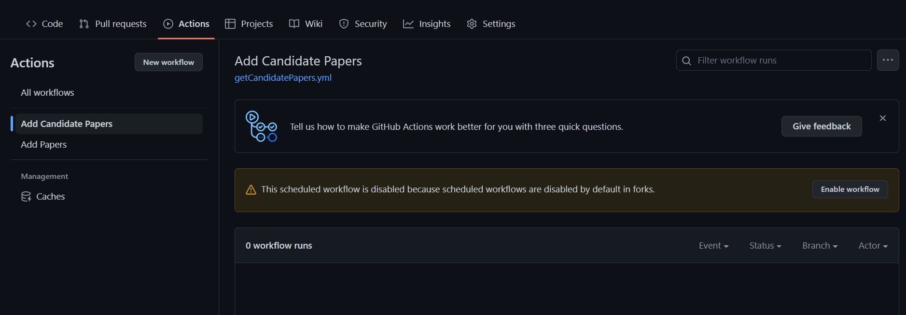

# Research Literature Manager

This is a project that makes it simple to manage the research papers you have read!

## How to use

1. Fork this repository to your own account.
2. Go to the `Actions` tab and enable running of the workflows (they are disabled by default for forked repositories). Click on `I understand my workflows, go ahead and enable them`.
   
3. In the `Actions` tab itself, go to each of the two workflows, namely `Add Candidate Papers` and `Add Papers`, and enable they manually if they are disabled.
   
4. Open the file `papersToAdd.txt` in the GitHub editor, and paste the links of the papers you want to add in the file (one link in each line) and commit the chanegs.

After this, automated actions with fire which will use Semantic Scholar to fetch details about those papers, and then subsequently fetch some candidate papers which might be relevant to your project.

After the actions are complete, you can explore the `data` folder, which will have the following files updated:

- `records.json`: Contains all the information about the papers that you added.
- `currentPapers.csv`: Contains formatted information about the papers currently in the database.
- `candidatePapers.csv`: Contains formatted information about possible candidate papers for your database.

### Note

If some papers could not be found using the links provided, those papers would be left in the `papersToAdd.txt` itself. You can try replacing them with some other link to add them to the database using the scripts.

The scripts and Semantic Scholar API works best with `arxiv` and `semanticScholar` links, so try to use them as much as possible.

### Sample Input

Here is a sample list of papers related to `Numbers in Text` that you can directly put in the `papersToAdd.txt` to quickly checkout the actions:-

```
https://arxiv.org/abs/1803.02155
https://arxiv.org/abs/1808.09637
https://arxiv.org/abs/1809.05356
https://arxiv.org/abs/1909.03065
https://arxiv.org/abs/1910.06611
https://arxiv.org/abs/1912.13283
https://arxiv.org/abs/2003.07629
https://arxiv.org/abs/2004.02363
https://arxiv.org/abs/2004.07085
https://arxiv.org/abs/2004.08500
https://arxiv.org/abs/2004.12193
https://arxiv.org/abs/2005.00242
https://arxiv.org/abs/2005.00683
https://arxiv.org/abs/2005.08516
https://arxiv.org/abs/2005.08517
https://arxiv.org/abs/2006.01681
https://arxiv.org/abs/2006.03274
https://arxiv.org/abs/2006.06609
https://arxiv.org/abs/2006.15595
https://arxiv.org/abs/2008.11990
https://arxiv.org/abs/2010.06666
https://arxiv.org/abs/2010.06973
https://arxiv.org/abs/2102.13019
https://arxiv.org/abs/2103.03874
https://arxiv.org/abs/2103.07191
```
