# Research Literature Manager

This is a project that makes it simple to manage the research papers you have read!

## How to Use

### Setting up the Repository

1. Click on the `Use this template` button to make a copy of this repository to your own Github account.
   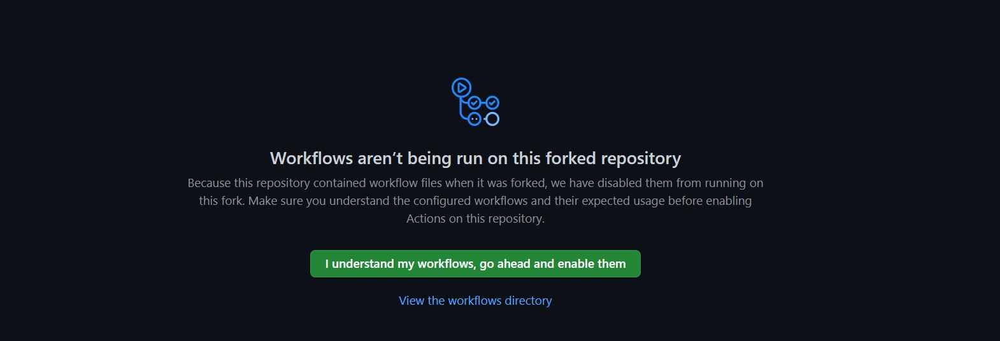
2. Go to the repository `Settings` on the GitHub UI, and under the `Code and Automation > Actions > General`, set the `Actions Permissions` to `Allow all actions and resuable workflows`.
   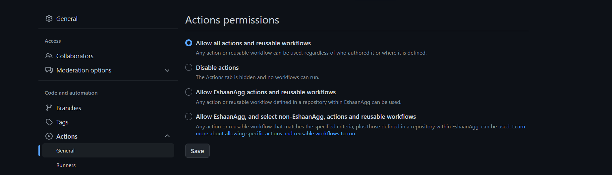
3. Open the file `papersToAdd.txt` in the GitHub editor, and paste the links of the papers you want to add in the file (one link in each line) and commit the chanegs.

After this, automated actions with fire which will use Semantic Scholar to fetch details about those papers, and then subsequently fetch some candidate papers which might be relevant to your project.

After the actions are complete, you can explore the `data` folder, which will have the following files updated:

- `records.json`: Contains all the information about the papers that you added.
- `candidateRecords.json`: Contains all the information about the possible candidate papers for your database.
- `currentPapers.csv`: Contains formatted information about the papers currently in the database.
- `candidatePapers.csv`: Contains formatted information about possible candidate papers for your database.

### Setting up the website

The projects ships with a simple website that you can use to easily view and visualise the papers you have listed. We will use `Netlify` to deploy the website once, which would then be updated automatically on every subsequent commit by Netlify's servers!

1. Go to [Netlify](https://www.netlify.com/) and Sign Up/Login with your Github Account.
   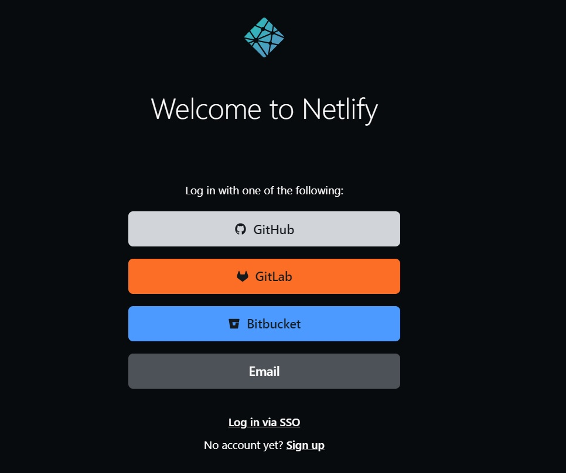
2. Netlify will ask you to allow access to your Github account (if you are using Netlify for the first time). Go ahead and grant it, it's 100% safe!
   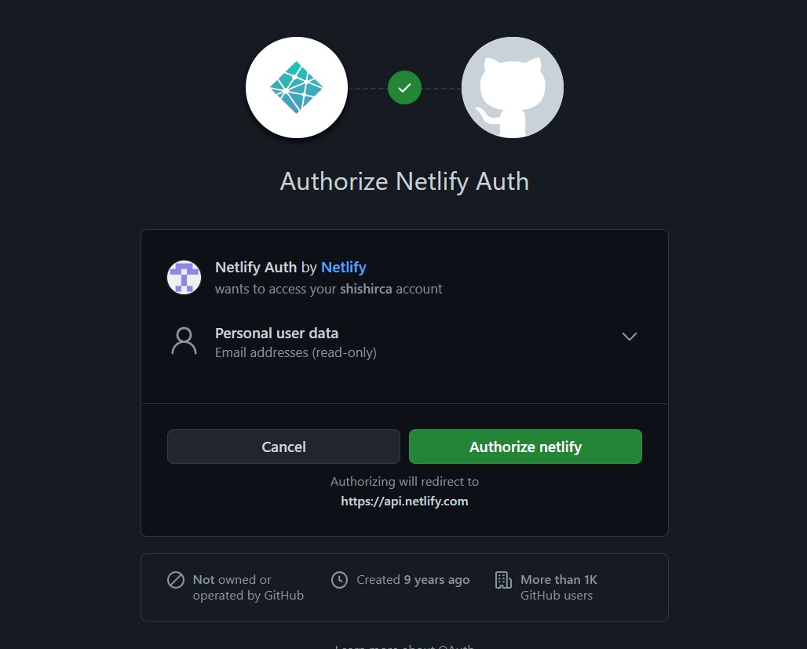
3. On your Netlify dashboard, click on `Import from Git` under the `Sites` section and choose `Github` as your provider.
   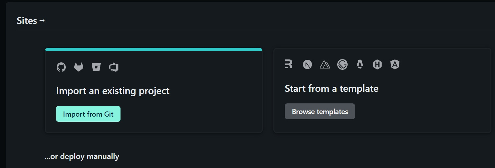
   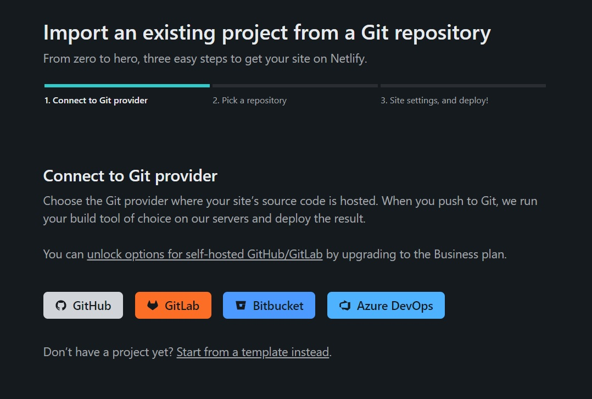
4. In the `Pick your repository` step, choose the repository that you created from the template in the previous step.
   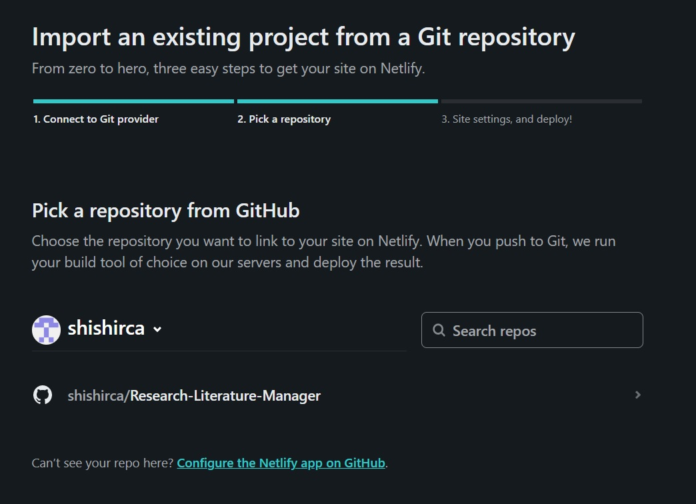
5. In the next `Basic Build Settings` page, and ensure the build settings are set to the following!
   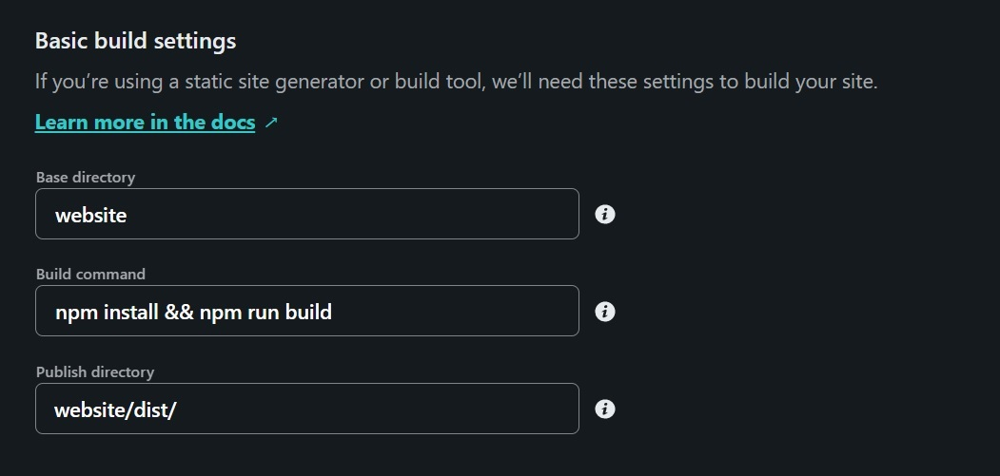
6. Wait for Netlify to deploy your site! After the deployment is complete, your site would get a public URL that you can bookmark and use to view your papers any time!
   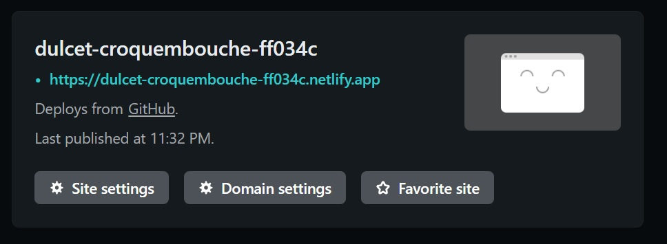

## Advanced Usage

### Customising the site content

You can naviagte to the `webiste/constants.json` file and change the value of the following fields, which would be dynamically updated on the generated webiste.

- `navbar-name`: The heading text that appears on the top of the side-nav-bar of the site.
- `navbar-name-abbreviation`: A two letter word which appears on the top of the side-nav-bar in the collapsed form.-
- `website-title`: The name that appears in the browser tab.
- `home-title`: The heading that appears on the landing page (home page) of the webite.
- `home-description`: The content that is displayed on the landing page (home page) under the heading.

### Customising Your Domain

You can go to your `Site Settings`, and then under the `Domain Management` Section, you can click on the `Domains` option to edit your randomly generated site name to something a little more you!
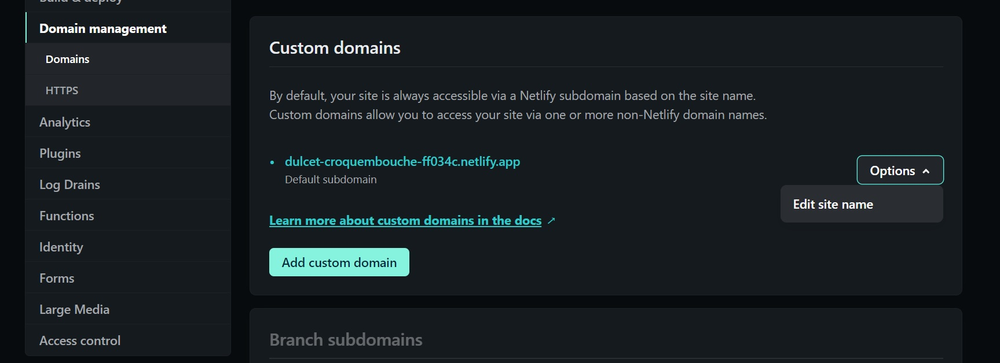

### Candidate Paper Algorithm

The algorithm that calculates the candidate papers resides in `scripts/addCandidatePapers.js`.

Currently, the algorithm works by fetching all the citations of the papers already present in the database, and then filters out the most popular papers amoung them (which have been repeatedly cited). If you want to customise this, this script is where you can write your own candidate paper fetching algorithm.

## Using the site

You can access the various sections of the site using the side navigation.
There are two primary pages:

1. `Current Papers`: This view shows all the current papers that are present in the database with some basic information about them.
2. `Candidate Papers`: This view lists all the prospective papers that the scripts have calculated on the basis of the papers already present in the system.

You can use the checkboxes in the `Candidate Papers` view to select the papers that you actually want to add to your list, and then click the `Add these papers` button. This would copy the paper details to your clipboard, which you can directly paste in the `papersToAdd.txt` in your repository and commit the changes.

The scripts would then automatically start running, and get a new set of candidate papers to be added in your database.
Since we are using GitHub, proper versioning of all the papers happens automatically in form of commits, and thus you can always rollback to your older versions if you want.

## Downloading the data

You can download the papers currently stored in your database in form of `csv` files.
You can do so in two ways:

1. `Using the Github UI`: Browse to `data` folder and then manually download `currentPapers.csv` and `candidatePapers.csv`.
2. `Using direct URL`: Open the following links in your browser:
   - `https://raw.githubusercontent.com/<YOUR_GITHUB_USERNAME>/<YOUR_REPOSITORY_NAME>/main/data/currentPapers.csv`
   - `https://raw.githubusercontent.com/<YOUR_GITHUB_USERNAME>/<YOUR_REPOSITORY_NAME>/main/data/candidatePapers.csv`

## Using Bibfiles

You can use bibfiles to import papers into the system as well. To do so, just copy the content of the bib file into `data/upload.bib` and wait for the automated scripts to run. Then you can add the papers to the system same as candidate papers.

## Notes

1. If some papers could not be found using the links provided, those papers would be left in the `papersToAdd.txt` itself. You can try replacing them with some other link to add them to the database using the scripts.

2. The scripts and Semantic Scholar API works best with `arxiv` and `semanticScholar` links, so try to use them as much as possible.

3. You can change the number of candidate papers that are fetched in every workflow run. By default, the number of candidate papers fetched is set to 200. To change it, go to the file `scripts/addCandidatePapers.js` and change the value of `NUMBER_OF_CANDIDATE_PAPERS_TO_FETCH` in `line 1` to the required number.

4. By default, new candidate papers are fetched whenever new papers are added to the repository and on the first of every month. You can even manually run the script to fetch the papers. To do so, go to the `Actions` tab on your repository, and then choose `Add Candidate Papers` workflow. Then click on the `Run workflow` to manually run it.
   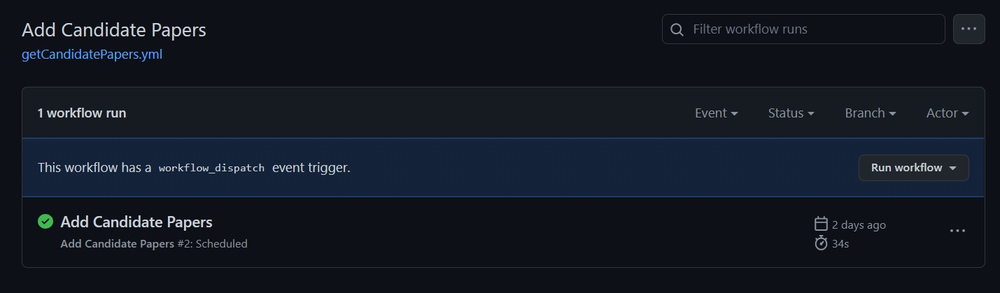

## Sample Input

Here is a sample list of papers related to `Numbers in Text` that you can directly put in the `papersToAdd.txt` to quickly checkout the actions:-

```
https://arxiv.org/abs/1803.02155
https://arxiv.org/abs/1808.09637
https://arxiv.org/abs/1809.05356
https://arxiv.org/abs/1909.03065
https://arxiv.org/abs/1910.06611
https://arxiv.org/abs/1912.13283
https://arxiv.org/abs/2003.07629
https://arxiv.org/abs/2004.02363
https://arxiv.org/abs/2004.07085
https://arxiv.org/abs/2004.08500
https://arxiv.org/abs/2004.12193
https://arxiv.org/abs/2005.00242
https://arxiv.org/abs/2005.00683
https://arxiv.org/abs/2005.08516
https://arxiv.org/abs/2005.08517
https://arxiv.org/abs/2006.01681
https://arxiv.org/abs/2006.03274
https://arxiv.org/abs/2006.06609
https://arxiv.org/abs/2006.15595
https://arxiv.org/abs/2008.11990
https://arxiv.org/abs/2010.06666
https://arxiv.org/abs/2010.06973
https://arxiv.org/abs/2102.13019
https://arxiv.org/abs/2103.03874
https://arxiv.org/abs/2103.07191
```

## Acknowledgements

(Please do not edit this section)

This repository was based on a free research-literature tool available here: https://github.com/EshaanAgg/Research-Literature-Manager. It wouldn't have been possible without the [Semantic Scholar API](https://www.semanticscholar.org/product/api), and [Github Actions](https://github.com/features/actions)!
Please cite us if you found it useful for your literature review:

```
@online{AggarwalThawani:2023,
  author = {Aggarwal, Eshaan and Thawani, Avijit},
  title = {Research Literature Manager},
  year = {2023},
  url = {https://github.com/EshaanAgg/Research-Literature-Manager},
}
```
